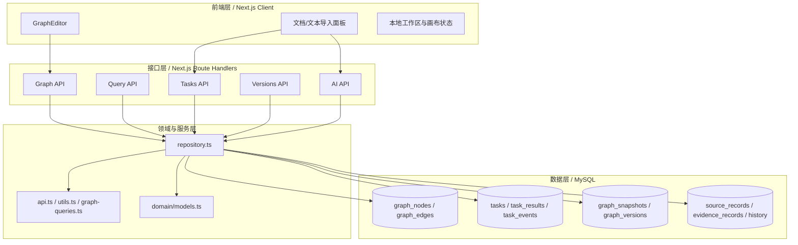
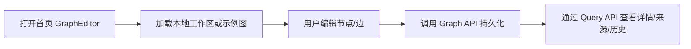
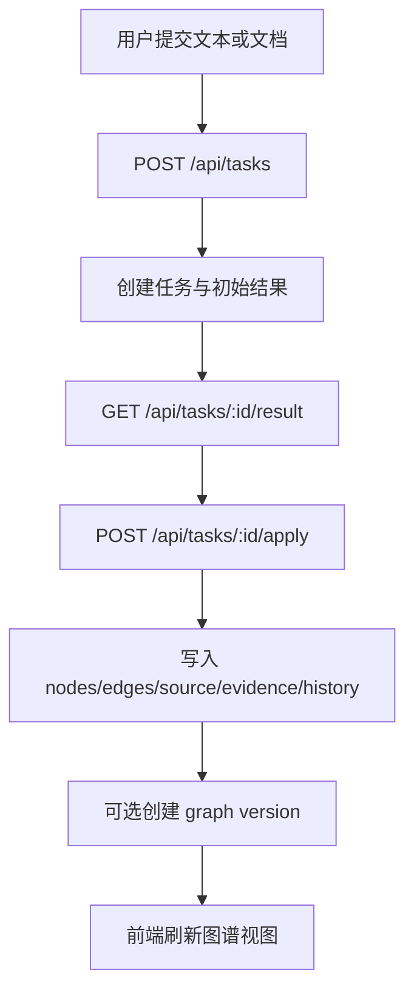
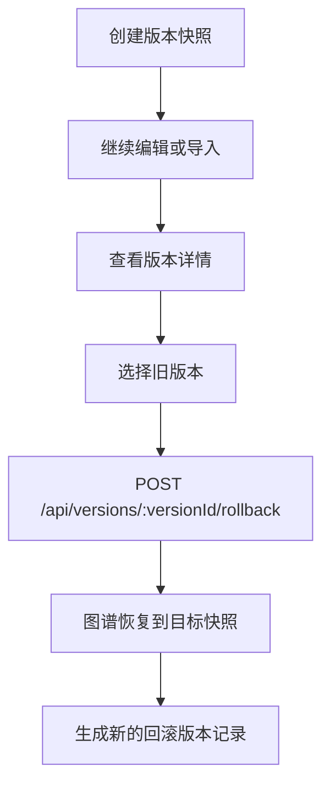

# ICVN - 当前基线架构文档

## 文档目的

本仓库已经不再是最初的 `Spring FES Video` 项目。
当前应以 `ICVN` 为唯一项目语义：一个面向人物关系/知识图谱的编辑、导入、查询与版本管理系统。

这份文档的目标不是描述一个“已经完成的理想系统”，而是给半成品项目建立一份**以现有代码为准**的架构基线，帮助后续 AI 与人工协作继续推进。

> 重要原则：
> - **代码现状高于旧文档**
> - **已存在但未验证的能力要明确标注为“待联调/待验收”**
> - **任务拆解应从“补齐半成品缺口”出发，而不是假设项目从零开始**

---

## 1. 项目定位

ICVN 是一个围绕“关系图谱”展开的应用，核心目标包括：

1. 在前端提供可视化图谱编辑器，用于创建、编辑、布局和查看节点/边。
2. 提供任务系统，将文本或文档提交给后端进行结构化解析。
3. 将解析结果标准化后应用到图谱中，并沉淀来源、证据和历史记录。
4. 提供图谱查询、局部子图、路径分析和版本回滚能力。

当前项目已具备较完整的后端接口骨架和一个较强的前端编辑器雏形，但整体仍属于**半成品**：

- 核心流程已经具备代码基础。
- 一部分能力已经可以在代码层面跑通。
- 但“真实 AI 解析”“完整前端任务中心”“端到端验收”仍未完成。

---

## 2. 当前代码基线

### 2.1 代码目录基线

- 工作流与任务定义位于仓库根目录：`CLAUDE.md`、`task.json`、`progress.txt`
- 实际应用位于：`ICVN-Project-master/`
- 前端与后端均使用 Next.js App Router
- 数据库当前采用 MySQL，而不是旧文档中的 Supabase / PostgreSQL

### 2.2 当前已确认存在的模块

| 模块 | 当前状态 | 说明 |
| --- | --- | --- |
| 图谱编辑器 UI | 已实现基础形态 | 首页直接加载 `GraphEditor` |
| 节点/边 API | 已实现 | 已有创建、更新、删除、图视图等路由 |
| Query 查询 API | 已实现 | 包含关系、详情、来源、历史、路径、搜索、子图 |
| 任务 API | 已实现 | 包含任务创建、详情、结果、事件、应用 |
| 版本 API | 已实现 | 包含创建版本、查询版本、回滚 |
| OpenAPI 文档 | 已存在 | `openapi.yaml` 定义了整体接口边界 |
| MySQL schema | 已存在 | `db/mysql/init.sql` 已定义核心表 |
| AI 解析入口 | 已存在但为过渡实现 | 当前更接近“本地合成结果/占位实现” |
| 前端导入流程 | 已有雏形 | 支持文本任务与文档任务入口 |

### 2.3 当前最重要的现实判断

当前后端的 `task -> result -> apply -> version` 链路已经有明显实现痕迹，但任务解析结果主要通过本地的 `synthetic-task-parser` 生成，用于打通流程，而不是接入真实生产级 AI 解析服务。

因此，当前项目最准确的定义是：

> **一个已经搭好了“图谱 + 任务 + 入图 + 版本”主骨架，但真实数据接入和产品化体验尚未补齐的 ICVN 半成品。**

---

## 3. 总体架构

---

## 4. 模块拆解

### 4.1 前端层

当前首页直接渲染图谱编辑器，说明前端的中心是“单页图谱工作台”。

前端主要承担：

1. 画布编辑：节点、边、布局、导出、撤销/重做、工作区文件。
2. 后端联调：调用任务、图谱、查询、版本等 API。
3. 导入流程：提交文档或文本，轮询任务，获取结果并应用到图谱。
4. 信息呈现：后续应补齐任务中心、节点详情、版本时间线、搜索/查询面板。

### 4.2 接口层

当前接口按职责划分为五组：

- `Graph API`：图谱节点、关系、图视图、子图
- `Query API`：节点详情、关系、来源、历史、路径、搜索
- `Task API`：任务创建、任务详情、结果查看、事件、应用
- `Version API`：版本创建、列表、详情、回滚
- `AI API`：AI 任务入口与状态查询的边界层

这说明项目方向不是“纯前端白板”，而是“带后端语义的图谱系统”。

### 4.3 服务与仓储层

当前后端核心逻辑集中在 `lib/server/repository.ts`，说明项目采用了相对清晰的“路由层薄、仓储层重”的组织方式：

- 路由层负责参数读取、错误包裹、HTTP 响应格式
- 仓储层负责事务、SQL、业务状态流转
- `domain/models.ts` 统一前后端共享类型
- `openapi-client.ts` 负责前端请求封装

这套结构适合继续演进，只需要避免把更多业务逻辑散落回 route 文件里。

---

## 5. 数据架构

当前 MySQL schema 已经体现出 ICVN 的核心数据模型。

### 5.1 核心实体

| 实体 | 作用 |
| --- | --- |
| `graphs` | 图谱空间 |
| `graph_nodes` | 图中的节点 |
| `graph_edges` | 图中的关系边 |
| `graph_snapshots` | 图谱快照 |
| `graph_versions` | 版本记录 |
| `tasks` | 文档/文本处理任务 |
| `task_results` | 结构化结果 |
| `task_events` | 任务生命周期事件 |
| `source_records` | 来源记录 |
| `entity_source_links` | 实体与来源的关联 |
| `evidence_records` | 证据片段 |
| `graph_change_history` | 图谱变更历史 |
| `ai_jobs` | AI 作业记录 |

### 5.2 数据设计意图

从表结构看，系统的目标不是只保存“一个图”，而是同时保留：

- 图谱结构本身
- 图谱是如何被导入/修改出来的
- 这些修改来自哪些任务、来源与证据
- 每次导入后能否沉淀版本、并支持回滚

这也是 ICVN 相比普通关系图编辑器最重要的差异化方向。

---

## 6. 关键业务流程

### 6.1 图谱编辑主流程

当前状态判断：

- 编辑器本身功能较多。
- 但默认是否优先加载后端真实图谱、以及各编辑操作是否全部稳定落库，仍需专项验收。

### 6.2 文档/文本入图主流程

当前状态判断：

- 这条链路在代码层面是目前最接近“最小闭环”的能力。
- 但解析结果仍以合成逻辑为主，生产级 AI 接入尚未完成。

### 6.3 版本回滚流程

当前状态判断：

- 后端有版本与回滚接口。
- 但前端是否存在完整版本管理界面，仍是待补齐能力。

---

## 7. 当前已实现能力 vs 待完成能力

### 7.1 已有基础

1. 图谱编辑器已经具备较强的前端交互基础。
2. 图谱、查询、任务、版本四大后端模块均已有接口和仓储实现。
3. MySQL schema 已具备较完整的领域表达能力。
4. OpenAPI 文档已经描述了系统边界。
5. 后端测试计划文档已经存在，说明项目具备进一步系统化验证的基础。

### 7.2 主要缺口

1. **文档与代码长期错位**：旧文档仍描述视频项目，已造成认知污染。
2. **真实 AI 解析尚未落地**：当前解析更偏 synthetic baseline。
3. **前端产品化页面不足**：编辑器强，但任务中心、版本面板、查询面板仍需补齐。
4. **端到端验收不足**：很多能力“看起来有”，但未形成可靠的验收闭环。
5. **环境说明不足**：启动、数据库初始化、联调步骤仍不够清晰。

---

## 8. 下一阶段开发策略

### 阶段 A：建立可靠基线

目标：先确认这个半成品到底哪些已经能用。

优先事项：

1. 修正 README / 初始化脚本 / 环境说明。
2. 验证 MySQL 初始化、默认图谱、基础 API 能否稳定运行。
3. 验证任务最小闭环：`create -> result -> apply -> graph view`。

### 阶段 B：补齐产品主流程

目标：让用户能在 UI 中完成真正的“导入 -> 入图 -> 查看 -> 回滚”。

优先事项：

1. 让首页优先加载真实后端图谱，而非仅示例数据。
2. 补齐任务中心与任务状态显示。
3. 补齐版本列表、版本详情、回滚交互。
4. 补齐节点详情、来源、证据、历史信息面板。

### 阶段 C：接入真实 AI 与验收体系

目标：从“演示型半成品”进入“可持续开发状态”。

优先事项：

1. 用真实 provider 替换 synthetic parser。
2. 按 `BACKEND_TEST_PLAN.md` 建立后端测试基线。
3. 增加最小 E2E 或手工验收清单。
4. 让任务与版本流具备稳定回归测试能力。

---

## 9. 架构决策

1. **以当前 ICVN 代码为真相来源**，废弃旧的视频项目语义。
2. **保留现有 Next.js + MySQL + Route Handler + repository 的结构**，不进行无必要重构。
3. **短期接受 synthetic parser 作为流程打通手段**，但必须在任务中明确其过渡属性。
4. **优先补齐主流程闭环，而不是继续堆新功能页面**。
5. **所有后续任务都应围绕“半成品补完”而不是“从零搭建”来设计**。

---

## 10. 对后续 AI Agent 的要求

后续 Agent 在处理 ICVN 时，应遵守以下策略：

1. 先读 `task.json`，只做一个明确边界的任务。
2. 修改前优先核对 `ICVN-Project-master/` 中已有实现，不要重复造轮子。
3. 若发现旧文档仍残留 `Spring FES Video`、`Supabase`、`hello-nextjs` 等语义，应主动视为历史遗留而非当前目标。
4. 对任何“已经写了但没验证”的模块，要优先补验收，不要直接宣称完成。
5. 若任务受真实数据库、真实 AI 配置或外部服务阻塞，应在 `progress.txt` 明确记录阻塞原因。
